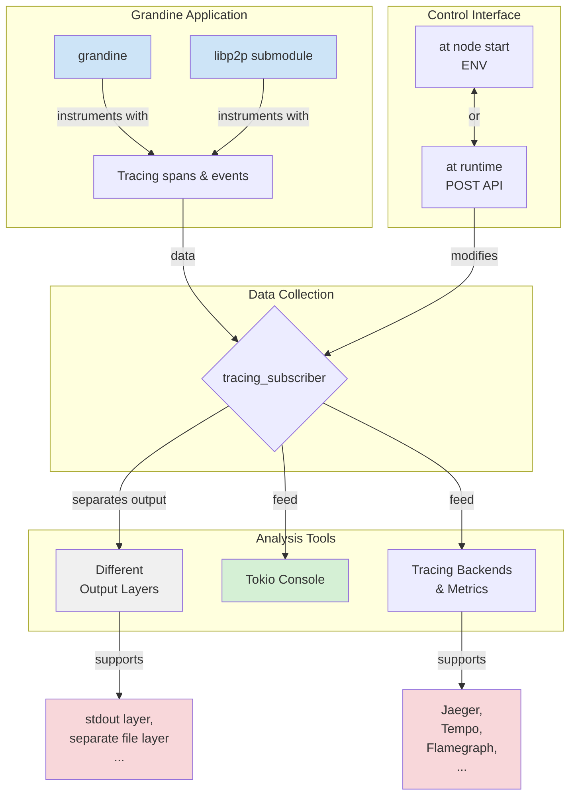

# Grandine: Implementing Tokio Tracing for Debugging and Performance Analysis

## Motivation

High-performance Ethereum clients like Grandine need deep observability to ensure correctness, stability, and optimal performance. For this reason, integrating Tokio Tracing is essential to improve debugging, performance analysis, and operational visibility across the protocol stack. [[Reference]](https://github.com/eth-protocol-fellows/cohort-six/blob/master/projects/project-ideas.md#grandine-implementing-tokio-tracing-for-debugging-and-performance-analysis)

Since effective debugging and observability often serve as a substitute for extensive documentation, I’m glad to focus on this area - it gives me a clearer understanding of what’s happening under the hood and opens the door to future protocol contributions.

Here is **[proposal video](https://www.youtube.com/watch?v=Y047VIkHe9Q&t=3s)** for [initial (outdated) project proposal](https://github.com/eth-protocol-fellows/cohort-six/blob/b5bd9ba73d1071e37284c5e2a6e583a83f5a0a41/projects/Grandine-Implementing-Tokio-Tracing-For-Debugging-And-Performance-Analysis.md).

---

### Current Implementation and Limitations

Currently, Grandine relies on basic logging solutions that do not provide structured, context-aware diagnostics. 

- It uses [binary_utils::initialize_logger()](https://github.com/grandinetech/grandine/blob/d13679310226c0c11ec03bfce7f9d925d1e46bd4/binary_utils/src/lib.rs), which sets up a traditional env_logger-based system.
- No structured spans linking related operations.
- Relies on a slog bridge and serialization to propagate information from the P2P submodule to the Grandine logger.
- Existing log output is harder to filter by component or operation and to attach at some observability backend.
- No advanced configuration for logging.
- No Runtime control - the logging level is fixed at node startup.
- Basic formatting

Grandine, like any other modern consensus client, supports asynchronous functions. While Rust has built-in async/await syntax, it requires an executor to actually run async code. In Grandine's case, that executor is **[Tokio](https://docs.rs/tokio/latest/tokio/)** — *the most widely used async runtime in the Rust ecosystem*.
However, classic loggers fall short in async contexts. They lack awareness of task relationships and execution flow.

This is where [**Tokio Tracing**](https://docs.rs/tracing/latest/tracing/) comes in:
The core concept of a [**span**](https://docs.rs/tracing/latest/tracing/span/index.html) allows you to represent timed operations with structured metadata and hierarchical relationships between events. All log events within a span are tied to its context, enabling a clear and navigable view of async workflows.

This approach has already proven valuable in practice. For instance [Lighthouse](https://github.com/sigp/lighthouse), another Rust-based Ethereum consensus client, has already migrated to Tracing to solve similar issues: [PR: #6070](https://github.com/sigp/lighthouse/pull/6070), [PR: #6339](https://github.com/sigp/lighthouse/pull/6339), [PR: #4979](https://github.com/sigp/lighthouse/pull/4979).

---
## Project description and Overview

This proposal is about to integrate Tokio Tracing into Grandine as the primary diagnostics and observability framework.
It replaces the existing log-based system with a modern, structured, and context-aware tracing solution. 
This integration will greatly improve the ability to debug complex asynchronous behavior, monitor runtime activity, and gain useful insight into system performance.

The solution will include:
- Instrumenting critical asynchronous components with spans (e.g., networking, block processing, consensus logic).
- Providing flexible filtering, layered outputs, and runtime configurability.
- Supporting fine-grained log level control for specific modules.
- Ensuring minimal performance overhead in production builds.
- Enabling asynchronous performance insight and future compatibility with profiling tools.

This approach empowers developers and operators to trace system behavior end-to-end, identify anomalies or performance bottlenecks, and maintain high reliability under production conditions.

**Tracing Backends & Metrics Systems** — **[Jaeger](https://grafana.com/docs/grafana/latest/datasources/jaeger/), [Tempo](https://grafana.com/oss/tempo/), [Flamegraphs](https://www.brendangregg.com/flamegraphs.html)**, and similar tools collect and visualize spans as trace timelines, enabling developers to explore system behavior and performance bottlenecks.
>[Tokio Console](https://github.com/tokio-rs/console) (optional) - provides real-time insights into async tasks, useful mainly during development.

----

## Specification

The implementation will deliver the following technical outcomes:

- **Tracing Integration**
  - A unified **tracing system** applied across the entire Grandine codebase, including submodules such as the [eth2_libp2p](https://github.com/grandinetech/eth2_libp2p).
  - All components will connect directly to a single central **`tracing_subscriber`**, without bridges, serialization..
  - Supports standard tracing levels (`ERROR`, `WARN`, `INFO`, `DEBUG`, `TRACE`), with control to enable them per module or crate, avoiding unnecessary overhead in unrelated parts of the client. 
  - The tracing system must also **support external dependencies** (e.g. [discv5](https://github.com/sigp/discv5)) that use the tracing crate, allowing unified control of their logging levels and output behavior.
  - The subscriber will expose **developer-only runtime controls** accessible via **environment variables at startup** or through a **POST API during runtime** - enabling tracing behavior changes without restarting the node.

- **Subscriber Architecture**
  - The **`tracing_subscriber`** will use a **layered design**, where each layer is responsible for a specific type of tracing output or events: 
    1. **Reload Layer**: attached to standard output, propagating a **reload handle** through **runtime** so tracing levels can be changed **dynamically** via **`POST API`**.
    2. **Exception Layer**: dedicated to handling **malicious** or **unusual** events, writing them to a separate log file (`exception.log`). 
    *(This layer is fixed and cannot be changed and always records information into the file.)*
  > Developers can optionally enable information from exception layer output on stdout (via `POST API` or `ENV`).

- **File-Based Logs**
  - The exception layer will enforce:
    - **File size limits** with **automatic log rotation** (keeping up to 5 recent files).
    - **Compression of older logs** to minimize storage use.
    - Guaranteed persistence of critical diagnostics without uncontrolled growth. 

- **Instrumentation**
  - Structured tracing spans will cover key areas of the system:
    - **HTTP API** & **P2P** network.  
    - **Consensus-critical components** such as fork choice and validator duties. 
  - All spans and events will include structured metadata to improve filtering and post-analysis. 

- **Advanced Tooling Compatibility**
  - Trace logs and spans will be structured for compatibility with observability systems such as Jaeger, Tempo, and Flamegraph, ensuring they can be visualized and analyzed effectively.
  - The design will allow future extensions for metrics integration.

- **Configurability**
  - Runtime behavior can be adjusted:
    - **Via environment variables** during node startup.
    - **Via POST API** during runtime for fine-grained tracing control. 
    > Supports selective tracing adjustments by developers while the node remains online

- **Demonstration & Usage**
  - Each pull request introducing tracing changes will include:
    - Practical examples of usage and configuration.
    - Demonstrations of runtime control or tracing outputs. 

---

## Challenges

Introducing tracing into a production-grade, asynchronous high-performance Rust client such as **Grandine** brings several technical and organizational challenges.
The main areas to be aware of are:

#### **Performance Overhead**
- Careful planning is required to ensure tracing does not slow down critical execution paths, especially by avoiding too many nested spans in frequently called code.

#### **Merge Conflicts and New Code Addaptation**
- Consensus client teams evolve quickly, integrating constant protocol updates.  
- Since tracing touches almost every file in the project, keeping the tracing branch up to date can quickly become a merge conflict nightmare.  
- While tracing is developed in a separate long-running branch, the main branch continues using the legacy logging system.  
- Every time new code is pulled from main branch, all newly added or modified sections must be reviewed and adapted to tracing - even if no merge conflict occurs.

#### **Asynchronous Complexity**
- Properly propagating context across tasks and futures can be tricky.
- Span types must be chosen with care to avoid async and thread-safety issues. 
(some spans are not fully async-safe)

#### **Rust Complexity**
- Grandine uses advanced Rust features to ensure best performance, so get along with that wouldn't be trivial.  

#### **Production vs. Debug Trade-off**
- A key challenge is balancing production performance with detailed diagnostic capabilities.  
- The tracing system must stay lightweight in production, while allowing selective activation of rich spans and detailed tracing in debug or tracing modes.  

#### **Tracing Backend Compatibility**
- Tracing spans and fields should be designed so that they make sense in external tools like Grafana.  
- Field names and metadata need to stay clear and useful for searching, filtering, or visualizing traces.

#### **Submodule Coordination**
- Maintaining consistency between the tracing implementation at Grandine and at P2P submodule(extracted from Lighthouse).  

#### **Runtime Verification**
- Unit and spec tests are not enough to validate tracing behavior.  
- The node should also be run and observed manually to verify how tracing behaves during startup, synchronization, and normal operation.

---

## Roadmap

Given the complexity and challenges outlined above, a careful, **incremental approach** is required to integrate tracing into Grandine.  
Following this roadmap, each phase delivers a fully functional and testable increment of the software, ensuring that consensus-spec-tests pass and the **node remains production-ready** at the end of every step.

### **Phase 1 – Foundational Setup**
- Set tracing configuration  
- Enable ENV override filter configuration  
- Enable tracing  

---

### **Phase 2 – Grandine Migration**
- Introduce specific tracing macros
- Migrate all Grandine logs to tracing macros  

---

### **Phase 3 – P2P Migration**
- Remove slog bridge
- Remove serialization
- Connect P2P submodule directly to tracing subscriber
- Migrate P2P logs to tracing

---

### **Phase 4 – Instrumentation**
- **Network:** HTTP API, P2P
- **Core:** Validator duties, Fork choice

---

### **Phase 5 – Runtime Control**
- Introduce **dynamic** tracing subscriber  
- POST API for runtime control  

---

### **Phase 6 – Write Unit Tests**
- For tracing behavior on different level
- For various tracing usage scenarios  

---

### **Phase 7 – Exception Layer**
- Introduce "exception" logs for malicious or unusual behavior
- Restrict visibility to developers (visible after configuration via ENV & POST API at Runtime)
- Add two-layer tracing subscriber design (dynamic stdout layer + exception file layer)
- Separate exception logs into a dedicated file for regular users

---

### **Phase 8 – Exception Log Rotation**
- Implement size limits for exception log files
- Add compression for archived logs

---

### **Phase 9 – Research Metrics Integration**
- Research useful tracing backends and metrics
- Explore optimizations for Prometheus pulls via directly tracing integration

---

## Goal of the project

**Success means Grandine will have:**
- Full structured tracing coverage across the entire client, its submodules and dependencies.  
- Ability to adjust tracing behavior at runtime - without restarting the node or disconnecting from the network.  
- Advanced tracing subscriber architecture with support for multiple, isolated outputs.  
- Minimal performance overhead in release builds.  
- Clear guides for developers and operators to debug, monitor, and analyze system behavior.  
- Greater confidence in performance, stability, and correctness as the client evolves.

Ultimately, this project will make **Grandine** a more **robust, maintainable, and secure Ethereum client** - ready for long-term evolution and observability.

---

## Colaborators

### Fellows

**[Vukasin Markovic](https://github.com/sntntn)**

### Mentors

**[Saulius](https://github.com/sauliusgrigaitis)** **&** **[Tumas](https://github.com/Tumas)**

## Implementation
- **[Full Repository Migration to Tokio Tracing & Dynamic Runtime Log Control #422](https://github.com/grandinetech/grandine/pull/422)** 
- **[eth2_libp2p migration to Tokio Tracing #21](https://github.com/grandinetech/eth2_libp2p/pull/21) (following submodule PR)**

- **[Two-Layer Tracing Subscriber Design with Dedicated Exception Log File and Local Timezone Support + Developer Controls + Tests #432](https://github.com/grandinetech/grandine/pull/432)**  
- **[rename 'crit' logs in 'exception' logs for better clarity #22](https://github.com/grandinetech/eth2_libp2p/pull/22) (following submodule PR)**
- **[rotate exception.log when it exceeds 1GB #456](https://github.com/grandinetech/grandine/pull/456#event-20727003149)**
- PR on hold (in case Grandine ever wants that output customization)
**[logging format: introduce AlignedFormatter for aligned log output with optional ANSI colors #447](https://github.com/grandinetech/grandine/pull/447)**

## Resources
- [Grandine GitHub Repository](https://github.com/grandinetech/grandine)
- [Resources used in implementation](https://hackmd.io/@sntntn/HyMabdFkZg)

